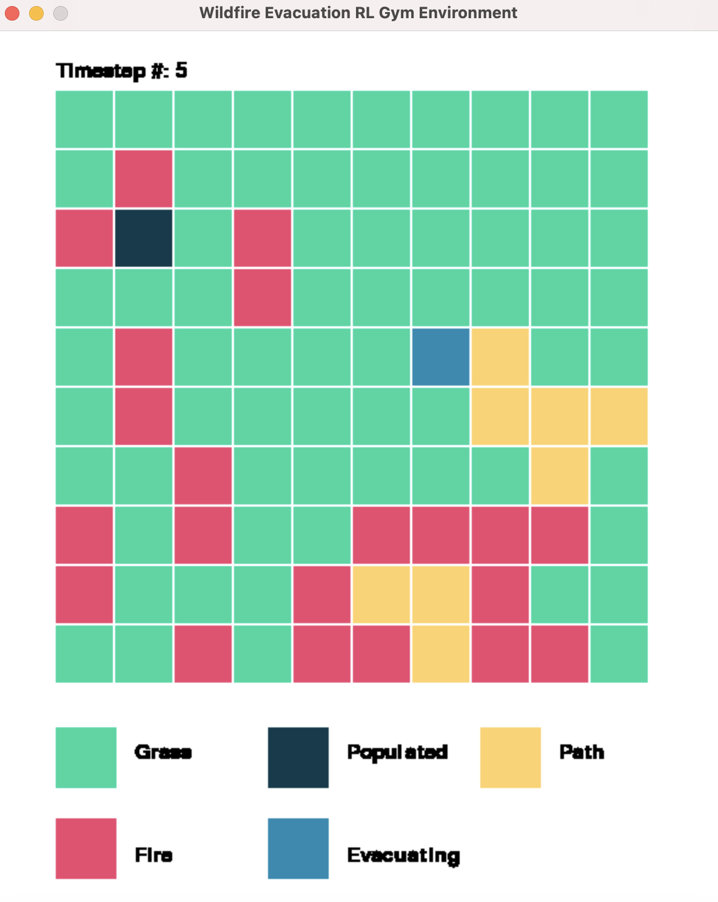

# Wildfire Evacuation RL Gym Environment

An RL gym environment for wildfire evacuation.

## How To Use

First, install our package:

```python
pip install wildfire-evac
```

To use our wildfire evacuation environment, define the dimensions of your grid, where the populated areas are, the paths, and which populated areas can use which path. See an example below.

```python
# Set up parameters
num_rows, num_cols = 10, 10
populated_areas = np.array([[1,2],[4,8], [6,4], [8, 7]])
paths = np.array([[[1,0],[1,1]], [[2,2],[3,2],[4,2],[4,1],[4,0]], [[2,9],[2,8],[3,8]], [[5,8],[6,8],[6,9]], [[7,7], [6,7], [6,8], [6,9]], [[8,6], [8,5], [9,5]], [[8,5], [9,5], [7,5],[7,4]]], dtype=object)
paths_to_pops = {0:[[1,2]], 1:[[1,2]], 2: [[4,8]], 3:[[4,8]], 4:[[8, 7]], 5:[[8, 7]], 6:[[6,4]]}

# Create environment
kwargs = {
    'num_rows': num_rows,
    'num_cols': num_cols,
    'populated_areas': populated_areas,
    'paths': paths,
    'paths_to_pops': paths_to_pops
}
env = gymnasium.make('wildfire_evac/WildfireEvacuation-v0', **kwargs)

# Run a simple loop of the environment
env.reset()
for _ in range(10):

    # Take action and observation
    action = env.action_space.sample()
    observation, reward, terminated, truncated, info = env.step(action)

    # Render environment and print reward
    env.render()
    print("Reward: " + str(reward))
```

Rendering the environment will reveal the following visualization:



For more examples, check out `examples/`.

## Set-Up

To set up our codebase, create a virtual environment and install all of necessary packages:

```bash
python3 -m venv env
source env/bin/activate
pip install -r requirements.txt
```

## Tests

We use `pytest` for our backend tests. To run our tests, run the following command from the outermost folder:
```bash
python3 -m pytest -s
```
