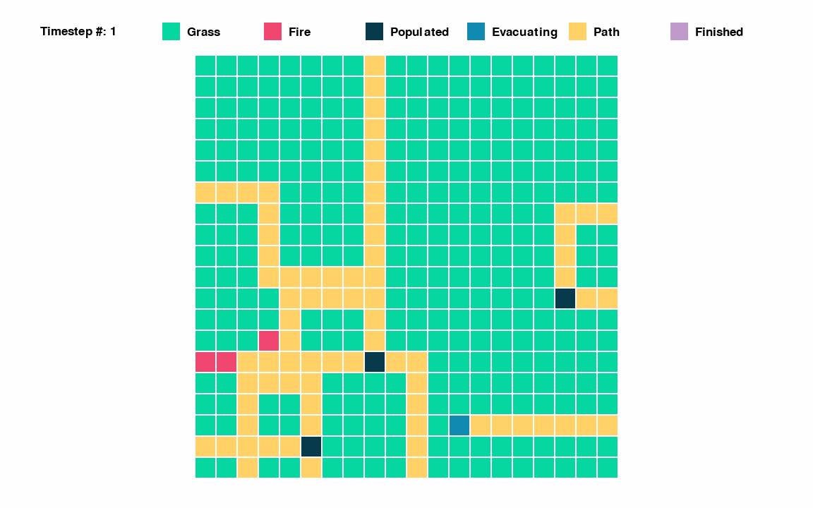

# Quickstart

## Installation

First, download our Python package:

```bash
pip install pyrorl
```

## Basic Usage 

### Environment Definition
To use our environment, you need to define five parameters:

- `num_rows` and `num_cols` – these two integers define a (`num_rows`, `num_cols`) grid world
- `populated_areas` – an array of `[x, y]` coordinates that indicate the location of the populated areas
- `paths` – an array of paths. Each path is an array of `[x, y]` coordinates that indicate each square in a path
- `paths_to_pops` – a dictionary that maps paths to which populated areas can use those paths. The keys are integers that represent the index of the path in the `paths` array. The values are arrays of integers that represent the populated area in the `populated_areas` array.

### Creating Maps
To create a map, you can specify each of the above parameters manually:

```python
num_rows, num_cols = 10, 10
populated_areas = np.array([[1,2],[4,8], [6,4], [8, 7]])
paths = np.array([[[1,0],[1,1]], [[2,2],[3,2],[4,2],[4,1],[4,0]], [[2,9],[2,8],[3,8]], [[5,8],[6,8],[6,9]], [[7,7], [6,7], [6,8], [6,9]], [[8,6], [8,5], [9,5]], [[8,5], [9,5], [7,5],[7,4]]], dtype=object)
paths_to_pops = {0:[[1,2]], 1:[[1,2]], 2: [[4,8]], 3:[[4,8]], 4:[[8, 7]], 5:[[8, 7]], 6:[[6,4]]}
```

We also provide functionality to generate custom maps programmatically. If you import `pyrorl.map_helpers.create_map_info`, you can create your own maps by specificying just a few parameters:

```python
# Import map helpers
from pyrorl.map_helpers.create_map_info import (
    generate_map_info,
    MAP_DIRECTORY,
    load_map_info,
)

# Set up parameters
num_rows, num_cols = 20, 20
num_populated_areas = 5

# example of generating map (other parameters are set to their default values)
populated_areas, paths, paths_to_pops = generate_map_info(
    num_rows,
    num_cols,
    num_populated_areas,
    save_map=True,
    steps_lower_bound=2,
    steps_upper_bound=4,
    percent_go_straight=50,
    num_paths_mean=3,
    num_paths_stdev=1,
)
```

If you set the `save_map` parameter to be `True`, you can also save the map configuration information to be used at a later time. You can then later load in the information for use:

```python
# showing how to load in the most recent map created for good measure,
# would otherwise just provide the desired map path to load_map_info
# (i.e. only use the last line with load_map_info)
map_info_root = os.path.join(os.getcwd(), MAP_DIRECTORY)
current_map_directory = max(
    os.listdir(map_info_root),
    key=lambda f: os.path.getctime(os.path.join(map_info_root, f)),
)
map_info_path = os.path.join(map_info_root, current_map_directory)
num_rows, num_cols, populated_areas, paths, paths_to_pops, num_populated_areas = (
    load_map_info(map_info_path)
)
```

### Running the Environment
Using these parameters, you can then define them as kwargs and use gymnasium.make to create the environment:

```python
# Note that additional parameters are listed (i.e. all parameters past paths_to_pops below). 
# These are currently set to their default values but can also be specified by the user.
kwargs = {
        'num_rows': num_rows,
        'num_cols': num_cols,
        'populated_areas': populated_areas,
        'paths': paths,
        'paths_to_pops': paths_to_pops,
        'num_fire_cells': 2,
        'custom_fire_locations': None, # would be a numpy array of locations if specified
        'wind_speed': None, # would be a float if specified
        'wind_angle': None, # would be a float if specified
        'fuel_mean': 8.5,
        'fuel_stdev': 3,
        'fire_propagation_rate': 0.094
    }
env = gymnasium.make('pyrorl/PyroRL-v0', **kwargs)
```

The wildfire environment has the following action and state/observation space:

- action_space: `[0, number of paths]`
- observation_space: `(5, num_rows, num_cols)` tensor, where every value in each dimension is between `[0, 200]`

Now, with all of this information, we can create a loop that samples an action from the action space, takes a step with the action, and renders the environment:

```python
env.reset()
for _ in range(20):

    # Take action and observation
    action = env.action_space.sample()
    observation, reward, terminated, truncated, info = env.step(action)

    # Render environment and print reward
    env.render()
    print("Reward: " + str(reward))

# Generate the gif
env.generate_gif()
```

### Rendering the Environment

Finally, we can see that the function `generate_gif` allows us to collate all of the visualizations generated by the `render` function and stitch them together into a GIF:



## Use with Stable Baselines 3

[Stable Baselines 3](https://stable-baselines3.readthedocs.io/en/master/) is a popular library for reinforcement learning algorithms. You can use Stable Baseline algorithms to find optimal policies for the wildfire evacuation problem. Given that our environment conforms to the `gymnasium` specification, training a model is no different than with other environments:

```python
# Train a model and delete
model = DQN("MlpPolicy", env, verbose=1)
model.learn(total_timesteps=1000, log_interval=4)
model.save("sample_baseline")
del model
```

The same is true for using the model during evaluation:

```python
# Load and reset the environment
model = DQN.load("sample_baseline")
obs, info = env.reset()

# Run a simple loop of the environment
for _ in range(10):
    action, _states = model.predict(obs, deterministic=True)
    observation, reward, terminated, truncated, info = env.step(int(action))

    # Render environment and print reward
    env.render()
    print("Reward: " + str(reward))
```
